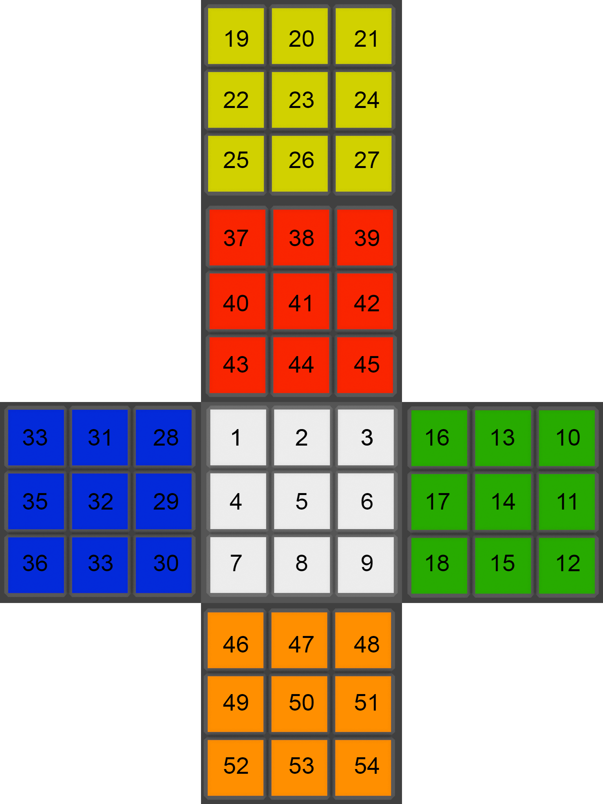
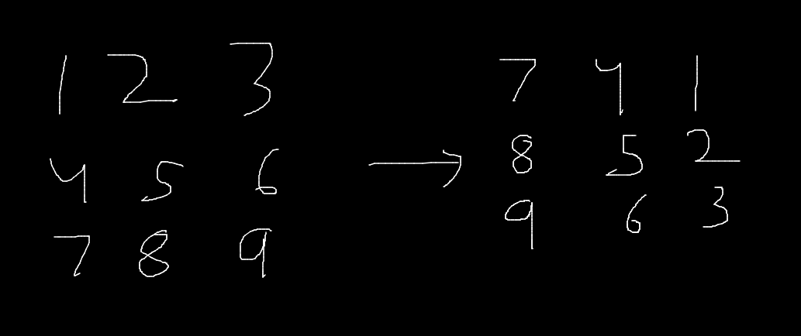

# Goal

This short project's goals were to create a sticker based Rubiks Cube interpretation in Python and create a function to find the order of a Rubik's Cube algorithm. The idea for this project for came to me when I realized that the [R U] algorithm has an order of 105.

# Definitions

#### Cube Notations
There are many different types of transformations you can apply to a cube, they are all listed clearly in this website by JPerm: https://jperm.net/3x3/moves

#### What is an algorithm?
In the context of Rubik's Cubes, an algorithm is defined as a set of moves that can be reversible applied the inverses of the moves in inverse order. An example of this would be [R U R' U'], which can be inversed by applying [U R U' R']. Any sequence created by cube notation is a valid algorithm.

#### Order of an algorithm
The order of an algorithm is defined as the number of times an algorithm needs to be repeated in order to return to its original state. As an example, the order of the algorithm [R U R' U'] is 6. 

# Proof
To make sure that repeating an algorithm eventually returns the cube to its original state, we must prove that it is true. Two key points to note are:

- The Rubik's Cube group is a finite group, thus only a finite number of combinations are possible

- The algorithms applied are reversible

From here, we can define a configuration as C(n), where C(0) is the starting state and C(1), C(2), C(3),... are the configurations you get by repeating a certain algorithm. Applying the algorithm once on C(n) will give C(n+1), applying it 50 times will give C(n+50)

The series of configurations C(0), C(1), C(2), C(3), C(4), ... is an infinite list, and a cube has finite configurations. Therefore, some configuration must be reached a second time. More formally, at some point, C(x) = C(y) for some x < y.

Using our second key point of algorithms being reversible tells us that it must be that if C(x) = C(y), then C(x-1) = C(y-1). This implies that C(x-x) = C(y-x), which gives us C(0) = C(y-x). So repeating a certain algorithm y-x times will return the cube back to its original state, or C(0).


# Sticker Based Implementation
<br>

### Sticker numbers
***
Before diving into finding the order of an algorithm, we should discuss how the sticker-based implementation works. Each sticker is numbered 1-54 as such:



The sticker pattern may seem unorthodox, but where the number is does not matter as long as the moves still simulate a real cube. Each face is numbered ascending from left to right, up to down, and is named in the order [F, R, B, L, U, D]. To see the right orientation of the L and R faces, you need to apply a y' move on the cube. The print function is overwritten such that when orientation, White = F, Red = U. This is for ease of debugging and testing.

##### In code implementation:
The in-code implementation is a dictionary of 3x3 matricies

```python
SOLVED_STATE = {
    "F": [[1,2,3], [4,5,6], [7,8,9]],
    "R": [[10,11,12], [13,14,15], [16,17,18]],
    "B": [[19,20,21], [22,23,24], [25,26,27]],
    "L": [[28,29,30], [31,32,33], [34,35,36]],
    "U": [[37,38,39], [40,41,42], [43,44,45]],
    "D": [[46,47,48], [49,50,51], [52,53,54]]
}
```
<br>

### 3x3 Grid Functions
***
These function apply transformations given a 3x3 matrix. these functions themselves won't represent a move such as a R move, but they serve as helper functions to code in the move functions.

##### replace_x function 
The `replace_x` group of function is very important, perticulary the `replace_R` function. The functions take 2 matricies, and copies one's "x" side to the other. For example, a replace_R with 
|m1|m2|
|---|---|
|[1,2,3]|[10,11,12]|
|[4,5,6]|[13,14,15]|
|[7,8,9]|[16,17,18]|

would result in m2 = 
[10,11,3]
[13,14,6]
[16,17,9]

and m1 remains the same. This function is useful to simulate a move, like R, where the right column of each matrix is being shiften up or down. 

##### rotate functions
With moves, faces are also rotated, so `rotate_r` and `rotate_l` simply rotate the 3x3 face right and left respectively. Example of `rotate_r`:




##### reversal function
Simply reverses a matrix
[1, 2, 3], [4, 5, 6], [7, 8, 9] ----> [9, 8, 7], [6, 5, 4], [3, 2, 1]

This is used in the y cube rotation function as it changes the orientation of the R and L faces since they are not normally oriented.

<br>

### Cube Rotations
***
Cube rotations consist of 3 moves: x,y,z. They are fairly simple as the faces themselves don't change, other than 2 face rotations, and rest are just swapped cyclically. 

The y rotation in perticular uses the reversal function as the R and L faces are numbered in a different orientation than the rest, and the y rotation swaps those faces. Since this is not the case with x rotations, they don't need the reversal function and simply only rotate the faces with `rotate_r` and `rotate_l` and cyclically rotate the faces. 

##### Code implementation:
```python
    def y(self):
        faces = self.faces.copy()
        self.faces["F"] = self.reversal(faces["R"])
        self.faces["R"] = faces["B"]
        self.faces["B"] = self.reversal(faces["L"])
        self.faces["L"] = faces["F"]
        self.faces["U"] = self.rotate_r(faces["U"])
        self.faces["D"] = self.rotate_l(faces["D"])
```

The x function is implemented similarly without the reversals. The z rotation can be achieved by applying [y' x y], which is what we do instead of writing new code for it.

<br>

### Cube Turns
***
The only turn that is actually newly coded is the `R` function, as using the rotations `x`, `y`, and `z` alongside `R`, we can combine them to create all other moves. This is inefficient compared to coding each move seperately, but the efficiency is barely changed and it was also easier to read and write.

An example of combining rotations and R to make other turns is the L turn, which can be achieved by the following sequence: [z2, R, z2].

##### Code implementation:
```python
    # Right Turn 
    def R(self):
        temp_F = [row[2] for row in self.faces["F"]]
        temp_U = [row[2] for row in self.faces["U"]]
        temp_B = [row[2] for row in self.faces["B"]]
        temp_D = [row[2] for row in self.faces["D"]]

        self.replace_R(temp_F, "U")
        self.replace_R(temp_U, "B")
        self.replace_R(temp_B, "D")
        self.replace_R(temp_D, "F")
        
        self.faces["R"] = self.rotate_r(self.faces.copy()["R"])
        
    # Left Turn
    def L(self):
        self.z_2()
        self.R()
        self.z_2()
```

We use a similar method to create slice moves and wide moves, for example:

M = [R, L', x']

r/rw = [R, M']

<br>

### Primes, Double moves, and Algorithm Execution
***
All the move functions are in there base form, meaning there are no function with primes and double moves such as R2 or L'. This is to avoid too many functions, as these functions are just repititions of the base functions. For example, R2 is [R R] and L' is [L L L]. This is why there is the `rep` function, that repeats a move a given amount of times. This way, all double and prime moves can be done using one function.

Executing each move as a function one at a time is tedious, instead, you can use the `execute` function. It takes a string of moves and applies it to the cube. The string needs to have each move space seperated and correctly spelled with case sensitivity.

##### Code Implementation:
```python
    def execute(self, seq:str):
        moves = seq.split(" ")
        for move in moves:
            if len(move) == 2:
               if move[1] == "'":
                   rep = 3
               else:
                   rep = 2
            else:
                rep = 1 
        
            self.rep(move[0], rep)
```