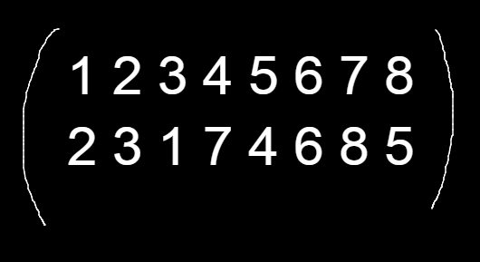
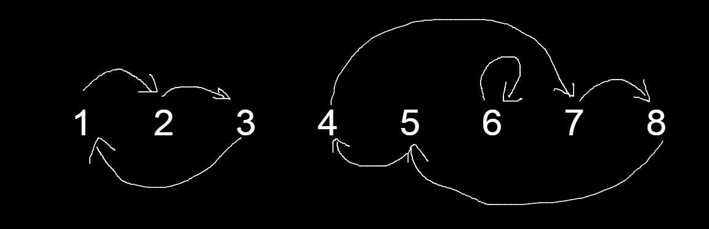
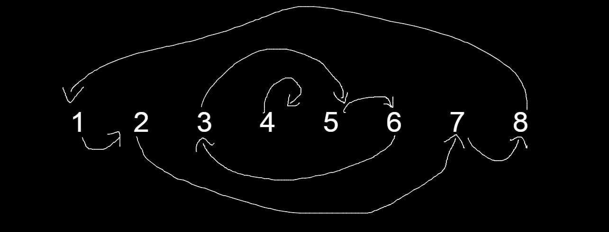
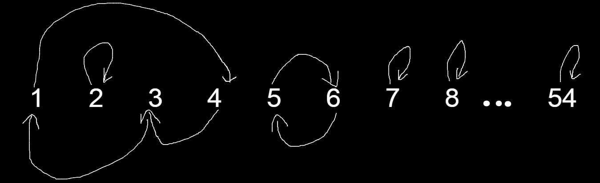

# Goal

This short project's goals were to create a sticker based Rubiks Cube interpretation in Python and create a function to find the order of a Rubik's Cube algorithm. The idea for this project for came to me when I realized that the [R U] algorithm has an order of 105.

# Definitions

#### Cube Notations
There are many different types of transformations you can apply to a cube, they are all listed clearly in this website by JPerm: https://jperm.net/3x3/moves

#### What is an algorithm?
In the context of Rubik's Cubes, an algorithm is defined as a set of moves that can be reversible applied the inverses of the moves in inverse order. An example of this would be [R U R' U'], which can be inversed by applying [U R U' R']. Any sequence created by cube notation is a valid algorithm.

#### Order of an algorithm
The order of an algorithm is defined as the number of times an algorithm needs to be repeated in order to return to its original state. As an example, the order of the algorithm [R U R' U'] is 6. 

# Proof
To make sure that repeating an algorithm eventually returns the cube to its original state, we must prove that it is true. Two key points to note are:

- The Rubik's Cube group is a finite group, thus only a finite number of combinations are possible

- The algorithms applied are reversible

From here, we can define a configuration as C(n), where C(0) is the starting state and C(1), C(2), C(3),... are the configurations you get by repeating a certain algorithm. Applying the algorithm once on C(n) will give C(n+1), applying it 50 times will give C(n+50)

The series of configurations C(0), C(1), C(2), C(3), C(4), ... is an infinite list, and a cube has finite configurations. Therefore, some configuration must be reached a second time. More formally, at some point, C(x) = C(y) for some x < y.

Using our second key point of algorithms being reversible tells us that it must be that if C(x) = C(y), then C(x-1) = C(y-1). This implies that C(x-x) = C(y-x), which gives us C(0) = C(y-x). So repeating a certain algorithm y-x times will return the cube back to its original state, or C(0).


# Sticker Based Implementation
<br>

### Sticker numbers
***
Before diving into finding the order of an algorithm, we should discuss how the sticker-based implementation works. Each sticker is numbered 1-54 as such:


The sticker pattern may seem unorthodox, but where the number is does not matter as long as the moves still simulate a real cube. Each face is numbered ascending from left to right, up to down, and is named in the order [F, R, B, L, U, D]. To see the right orientation of the L and R faces, you need to apply a y' move on the cube. The print function is overwritten such that when orientation, White = F, Red = U. This is for ease of debugging and testing.

##### In code implementation:
The in-code implementation is a dictionary of 3x3 matricies

```python
SOLVED_STATE = {
    "F": [[1,2,3], [4,5,6], [7,8,9]],
    "R": [[10,11,12], [13,14,15], [16,17,18]],
    "B": [[19,20,21], [22,23,24], [25,26,27]],
    "L": [[28,29,30], [31,32,33], [34,35,36]],
    "U": [[37,38,39], [40,41,42], [43,44,45]],
    "D": [[46,47,48], [49,50,51], [52,53,54]]
}
```
<br>

### 3x3 Grid Functions
***
These function apply transformations given a 3x3 matrix. these functions themselves won't represent a move such as a R move, but they serve as helper functions to code in the move functions.

##### replace_x function 
The `replace_x` group of function is very important, perticulary the `replace_R` function. The functions take 2 matricies, and copies one's "x" side to the other. For example, a replace_R with 
|m1|m2|
|---|---|
|[1,2,3]|[10,11,12]|
|[4,5,6]|[13,14,15]|
|[7,8,9]|[16,17,18]|

would result in m2 = 
[10,11,3]
[13,14,6]
[16,17,9]

and m1 remains the same. This function is useful to simulate a move, like R, where the right column of each matrix is being shiften up or down. 

##### rotate functions
With moves, faces are also rotated, so `rotate_r` and `rotate_l` simply rotate the 3x3 face right and left respectively. Example of `rotate_r`:


##### reversal function
Simply reverses a matrix
[1, 2, 3], [4, 5, 6], [7, 8, 9] ----> [9, 8, 7], [6, 5, 4], [3, 2, 1]

This is used in the y cube rotation function as it changes the orientation of the R and L faces since they are not normally oriented.

<br>

### Cube Rotations
***
Cube rotations consist of 3 moves: x,y,z. They are fairly simple as the faces themselves don't change, other than 2 face rotations, and rest are just swapped cyclically. 

The y rotation in perticular uses the reversal function as the R and L faces are numbered in a different orientation than the rest, and the y rotation swaps those faces. Since this is not the case with x rotations, they don't need the reversal function and simply only rotate the faces with `rotate_r` and `rotate_l` and cyclically rotate the faces. 

##### Code implementation:
```python
    def y(self):
        faces = self.faces.copy()
        self.faces["F"] = self.reversal(faces["R"])
        self.faces["R"] = faces["B"]
        self.faces["B"] = self.reversal(faces["L"])
        self.faces["L"] = faces["F"]
        self.faces["U"] = self.rotate_r(faces["U"])
        self.faces["D"] = self.rotate_l(faces["D"])
```

The x function is implemented similarly without the reversals. The z rotation can be achieved by applying [y' x y], which is what we do instead of writing new code for it.

<br>

### Cube Turns
***
The only turn that is actually newly coded is the `R` function, as using the rotations `x`, `y`, and `z` alongside `R`, we can combine them to create all other moves. This is inefficient compared to coding each move seperately, but the efficiency is barely changed and it was also easier to read and write.

An example of combining rotations and R to make other turns is the L turn, which can be achieved by the following sequence: [z2, R, z2].

##### Code implementation:
```python
    # Right Turn 
    def R(self):
        temp_F = [row[2] for row in self.faces["F"]]
        temp_U = [row[2] for row in self.faces["U"]]
        temp_B = [row[2] for row in self.faces["B"]]
        temp_D = [row[2] for row in self.faces["D"]]

        self.replace_R(temp_F, "U")
        self.replace_R(temp_U, "B")
        self.replace_R(temp_B, "D")
        self.replace_R(temp_D, "F")
        
        self.faces["R"] = self.rotate_r(self.faces.copy()["R"])
        
    # Left Turn
    def L(self):
        self.z_2()
        self.R()
        self.z_2()
```

We use a similar method to create slice moves and wide moves, for example:

M = [R, L', x']

r/rw = [R, M']

<br>

### Primes, Double moves, and Algorithm Execution
***
All the move functions are in there base form, meaning there are no function with primes and double moves such as R2 or L'. This is to avoid too many functions, as these functions are just repititions of the base functions. For example, R2 is [R R] and L' is [L L L]. This is why there is the `rep` function, that repeats a move a given amount of times. This way, all double and prime moves can be done using one function.

Executing each move as a function one at a time is tedious, instead, you can use the `execute` function. It takes a string of moves and applies it to the cube. The string needs to have each move space seperated and correctly spelled with case sensitivity.

##### Code Implementation:
```python
    def execute(self, seq:str):
        moves = seq.split(" ")
        for move in moves:
            if len(move) == 2:
               if move[1] == "'":
                   rep = 3
               else:
                   rep = 2
            else:
                rep = 1 
        
            self.rep(move[0], rep)
```
<br>
<br>
<br>

# Finding the Order of an Algorithm
<br>

### Methods
***
The most obvious method is brute force. We can simply apply the algorithm in a loop and check if its solved each time. code:

```python
from Cube import Cube, SOLVED_STATE
def brute_force(alg:str):
    c = Cube()
    order = 0
    while True:
        c.execute(alg)
        order+=1
        if c.faces == SOLVED_STATE:
            return order
```

Of course this method is not efficient, especially for long algorithms or algorithms with high orders. Another idea was to pair brute force with group symmetries. The idea is to find another algorithm that has the same effect, but is shorter, and use that to brute force.

This is takes away the issue of long algorithms, but the order could still be high. On top of that, I am not capable enough of finding symmetries yet and we would still be using brute force, which did not sit right with me.

<br>

### Cycle Classes of Permutations
***
Since the stickers of a cube make a set, an algorithm executed on a cube will give us a permutation of the set. it is important to have knowledge about permutations, cycles and graph theory. A permutation is a mapping from the set to itself, similar to a dict object in Python. As an example, the permutation:



Will have the following graph:

 

A cycle of a permutation is a subset of the permutation which goes in the same orbit. The above example has the cycles (1 2 3), (4 5 7 8) and (6)

We can sort permutations into cycles classes. Two permutations are in the same class if the lengths of all the cycles are all the same. For example, both the permutations below are in the same cycle class:




Notice that they both have one cycle of length 1, length 4 and length 3. This is why they are in the same cycle class. This essentially allows us to not worry about the order and the numbers of the stickers when making the sticker based implementation. Changing where are what numbers will still keep the permutation of stickers in the same cycle class.
<br>

### Applying Cycles, Classes and Permutations to Find the Order of an Algorithms
***

Often times, people think of Rubik's Cubes as a 3x3x3 matrix where each piece has a unique id and an orientation. The sticker-based implementation of a Rubiks Cube makes it very easy to visualize the Rubiks Cube as the set [1,2,3...,54]. We will refer to this set as RC. 

This way, we can view an algorithm as a permutation of the set RC. Using this permutation, we can make a graph out of it, and figure out the cycle lengths of each sticker. For example, if we look at this segment of a hypothetical graph of an algorithm:



<i><small> Assume numbers between 8 and 54 map to themselves</small></i>

It is key to keep in mind that every time the algorithm is executed, each sticker moves to its next spot in the cycle. 

We can infer that the algorithm does not affect the positions of stickers 2 and 7 through 54. Notice that there are 2 cycles of lenghts 2 and 3: (5 6) and (1 3 4) respectively. To return a cycle back to its original state, you must execute the algorithm x times where x is its length. For example, cycling (1 3 4) looks like this:

| Execution Count | Cycle State |
|---|--|
|1|(4 1 3)|
|2|(3 4 1)|
|3|(1 3 4)|

and cycling (5 6) looks like this:

| Execution Count | Cycle State |
|---|--|
|1|(6 5)|
|2|(5 6)|

To return a permutation to its original state, set RC, would be akin to solving the rubiks cube. More formally, lets define a function A which simulates executing an algorithm on a set. For a sequence of sets S(0), S(1), S(2), S(3), S(4), ... S(n), where S(i+1) = A(S(i)) and S(n) = set RC and S(0) = set RC, we need to find the length of the sequence, or n, which is how many times A needs to be repeated.

To get to S(n) would mean to have all the cycles return to their original state at the same time. Since we know a cycle returns to its original state after being cycled as many times as its length, the number of times A is repeated or n =

LCM(L<sub>1</sub>, L<sub>2</sub>, L<sub>3</sub>, ... , L<sub>54</sub>) 

where L<sub>i</sub> is the cycle length of sticker i.

##### Code implementation:
```python
from Cube import Cube
import math
from functools import reduce
SOLVED_STATE = {
    "F": [[1,2,3], [4,5,6], [7,8,9]],
    "R": [[10,11,12], [13,14,15], [16,17,18]],
    "B": [[19,20,21], [22,23,24], [25,26,27]],
    "L": [[28,29,30], [31,32,33], [34,35,36]],
    "U": [[37,38,39], [40,41,42], [43,44,45]],
    "D": [[46,47,48], [49,50,51], [52,53,54]]
}

def calculate_order(alg:str):
    visited = []
    cycles = []
    c = Cube()
    c.execute(alg)
    def cycle(cube: Cube, face, i, j, lvl):
        target = SOLVED_STATE[face][i][j]
        if target in visited:
            cycles.append(lvl)
            visited.clear()
            return
        visited.append(cube.faces[face][i][j])

        for new_face in ["F", "R", "B", "L", "U", "D"]:
            for new_i in range(3):
                for new_j in range(3):
                    if target == cube.faces[new_face][new_i][new_j]:
                        cycle(cube, new_face, new_i, new_j, lvl+1)
                        return
    
    for face in ["F", "R", "B", "L", "U", "D"]:
        for i in range(3):
            for j in range(3):
                if SOLVED_STATE[face][i][j] != c.faces[face][i][j]:  
                    cycle(c, face, i, j, 1)
    
    order = reduce(math.lcm, cycles)
    return order 

```

This code uses a recursive DFS approach to find all cycle lengths, achieved by using the `cycle` function, which finds the cycle length of a sticker. The lengths are put them in a list, and we simply find the lcm of all cycle lengths. This way the algorithm is only executed once as opposed to the brute force method, where the algorithm is executed as many times as the order.


<br>

### Efficiency Comparision Between the Two Methods 

The second method is much more efficient compared to brute forcing, as it only needs to execute the algorithm once. To truly test the power, I set up a script:

```python
import time
from alg_order import calculate_order, brute_force

# Example input for testing
alg = "R U R' U' D F L x D y L"

# Number of iterations
iterations = 1000

# Measure time for calculate_order
calculate_order_total_time = 0
for _ in range(iterations):
    start_time = time.time()
    calculate_order_result = calculate_order(alg)
    end_time = time.time()
    calculate_order_total_time += end_time - start_time

calculate_order_avg_time = calculate_order_total_time / iterations

# Measure time for brute_force
brute_force_total_time = 0
for _ in range(iterations):
    start_time = time.time()
    brute_force_result = brute_force(alg)
    end_time = time.time()
    brute_force_total_time += end_time - start_time

brute_force_avg_time = brute_force_total_time / iterations

# Calculate the speedup
speedup = brute_force_avg_time / calculate_order_avg_time

print(speedup)

>>>>> 14.62
```

Using the second method is 14.62x faster than brute forcing, and the number will go up for higher order and longer algorithms


